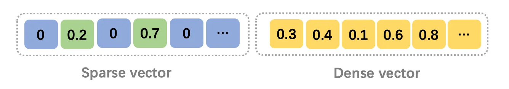
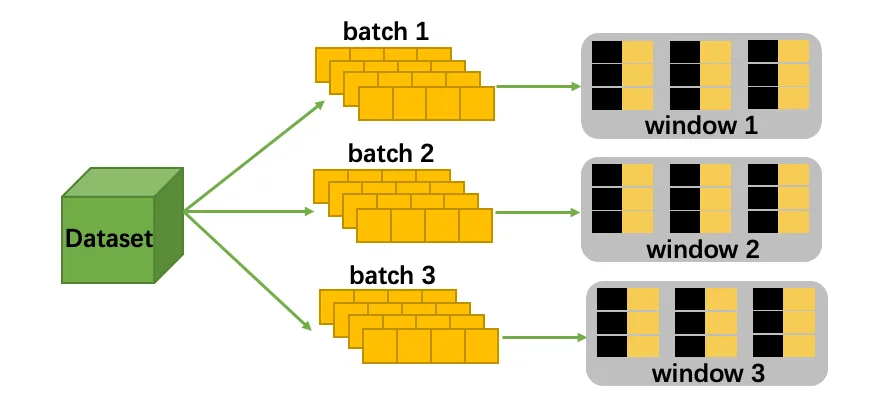
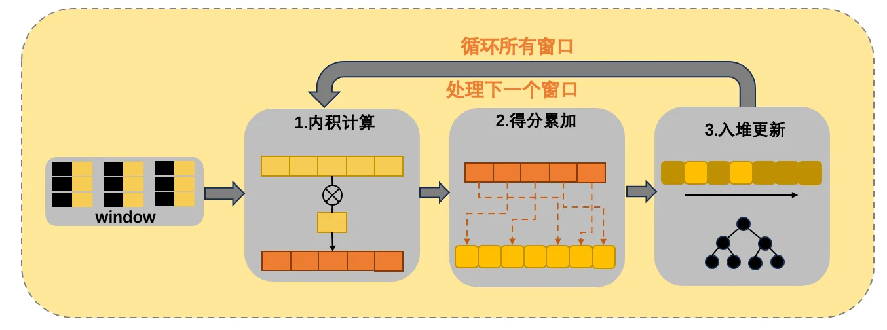

## 稀疏向量检索利器 -- 深度解读 SINDI 及其在 VSAG 上的工程实践

本文作者：VSAG Team

# 1、前言

## （1）背景

在 RAG（检索增强生成）、智能搜索和推荐系统中，单一召回链路越来越难覆盖真实业务里的全部查询形态。

**稠密向量召回（Dense Retrieval）** 擅长语义泛化：用户没有使用原文关键词时，模型仍然可以通过语义相似性找回相关内容。但它也有明显短板，例如专有名词、产品型号、错误码、长尾实体、代码符号等细粒度词项，往往需要非常精确的匹配信号。

**传统词项召回（BM25 / TF-IDF）** 守住了字面匹配的底线：只要查询词和文档词项重合，就能给出稳定、可解释的相关性分数。但它缺少深层语义理解，对同义改写、上下文语义和隐式意图不够敏感。

因此，工业界常见的高质量检索链路会采用 **BM25 + 稀疏向量 + 稠密向量** 的混合召回：BM25 负责字面匹配，稀疏向量负责可解释的语义化词项匹配，稠密向量负责整体语义泛化。三路信号互补后，通常比任意两路组合更稳。

## （2）什么是稀疏向量



图 1：稠密向量与稀疏向量的表示差异

稀疏向量可以理解为一组 `(term_id, weight)` 对。它的维度通常对应词表或特征空间，但一条向量只激活其中很少一部分维度。例如 SPLADE、uniCOIL、BGE-M3 sparse 等模型都会输出这类高维、稀疏、带权重的表示。

稀疏向量有三个重要特征：

1. ***高维且极度稀疏***：维度可以达到几万甚至几十万，但每条文档或查询只包含少量非零项。VSAG 中的 `SparseVector` 也正是用非零项数组保存 `ids_` 和 `vals_`，不会存储完整的零值维度。
2. ***语义化的词项扩展***：现代学习稀疏模型不只统计原文词频，还可以通过模型激活与上下文相关的词项，让稀疏表示具备一定语义扩展能力。它比纯 BM25 更“懂语境”，又比稠密向量更容易解释。
3. ***可解释性强***：每个非零维度都对应明确的词项或特征，权重也可以直接参与排查。线上出现 bad case 时，研发人员能够看到是哪些 term 拉高或拉低了分数。

这类数据的检索目标通常是最大内积搜索：给定查询稀疏向量 $q$ 和文档稀疏向量 $d$，计算二者重合 term 上的权重乘积和：

$$
score(q,d)=\sum_{t \in q \cap d}q_t \cdot d_t
$$

VSAG 的 SINDI 正是围绕这一计算模式设计的稀疏向量索引。

## （3）高性能稀疏向量倒排索引 -- SINDI

**`SINDI`** 是 是VSAG联合华东师范大学发表在数据库顶级会议 ICDE（CCF-A类）上专为稀疏向量设计的检索技术。它直接接收 `dtype: "sparse"` 的数据，当前支持内积（`metric_type: "ip"`）相似度，适合 BM25、SPLADE、BGE-M3 sparse 等稀疏表示的召回场景。

**`SINDI`** 能以极低的计算开销实现高效的近似最大内积搜索（AMIPS）。相比于传统的图索引和倒排索引，有以下几个好处：

1. ***内存友好***：通过量化、文档剪枝等策略，将内存占用控制在低水平。
2. ***极致的效率与精度平衡***：通过窗口分片，存值倒排和剪枝策略在高性能同时保持 SOTA 级精度。
3. ***参数分析***：SAG提供了对SINDI索引配置的分析能力，通过提供一系列分析数值指导索引的构建和选择参数，帮助用户更便捷地使用VSAG。

接下来，我们从实现角度拆解 SINDI 为什么能在稀疏向量场景中取得高效表现。

# 2、SINDI 的核心竞争力

## （1）Window-based 存值倒排结构



图 2：SINDI 的窗口化倒排结构

在稀疏向量检索里，瓶颈经常不只是乘法和加法本身，而是内存访问。传统倒排表如果只保存 document id，计算分数时还需要根据 id 回到原始向量区域查找 term 权重。这个过程会带来大量随机访问，CPU cache 命中率很差，吞吐很容易被内存延迟限制住。

SINDI 采用 **存值倒排（value-storing inverted list）**：每个 term list 同时保存局部文档 ID 和对应的 value。查询访问某个 term 时，可以从一段连续的数组中直接读出 `(inner_doc_id, value)`，计算 `query_value * doc_value` 后累加到窗口内的距离数组里。

VSAG 的实现还引入了 **window-based** 组织方式。构建时，文档按照 `window_size` 切分成多个窗口，每个窗口是一组独立的 term list。窗口内文档 ID 以 `uint16_t` 保存，因此 `window_size` 被限制在 10000 到 60000 之间，既能保持局部 ID 紧凑，也便于控制每轮查询需要维护的临时分数数组大小。

这种布局有两个直接收益：

1. ***更好的内存局部性***：同一个 term 的 doc id 和 value 连续存储，查询时顺序扫描，减少随机跳转。
2. ***更轻的 posting 表示***：窗口内局部 ID 比全局 ID 更小，倒排表中每个 posting 的 ID 部分只需 `uint16_t`。

在 `use_quantization: false` 时，posting value 以 `float` 保存；开启 `use_quantization: true` 后，value 会通过全局 min-max 参数编码为 8-bit，posting 中的 value 部分从 4 字节降到 1 字节。

## （2）Term-based 高效累分机制



图 3：SINDI 的按 term 累分流程

SINDI 查询阶段采用按 term 驱动的累分方式。给定一个查询向量，系统先处理查询的非零项，然后对每个窗口执行以下流程：

1. 读取查询 term 对应的倒排列表。
2. 顺序扫描 posting 中的文档局部 ID 和 value。
3. 将 `-(query_value * doc_value)` 累加到窗口内的 `dists` 数组。
4. 根据候选策略把命中的文档压入堆中。

这里使用负号是为了和 VSAG 统一的“距离越小越好”接口对齐。SINDI 最终返回的距离是：

$$
distance = 1 - inner\_product
$$

因此，内积越大，返回距离越小，排序方向和其他索引保持一致。

VSAG 中还提供了 `use_term_lists_heap_insert` 搜索参数，默认值为 `true`。开启后，SINDI 会沿着本次访问过的 term list 做候选入堆，而不是无差别扫描整个窗口的距离数组。对于高维稀疏数据，这通常可以减少大量无效候选检查。

## （3）多层剪枝策略

稀疏向量检索的计算量主要由两部分决定：查询激活了多少 term，以及这些 term 对应的倒排列表有多长。SINDI 围绕这两点提供了三类剪枝参数。

### （a）文档剪枝：`doc_prune_ratio`

`doc_prune_ratio` 在构建阶段生效。VSAG 会先按权重对单条文档的稀疏项排序，然后保留累计权重质量达到目标比例的高权重项。举例来说，当 `doc_prune_ratio = 0.4` 时，内部的保留比例为 `0.6`，低权重项会被剪掉。

文档剪枝可以缩短倒排列表、减少内存占用，也会带来一定召回损失。它适合长文档或稀疏项较多的数据集。

### （b）查询剪枝：`query_prune_ratio`

`query_prune_ratio` 在查询阶段生效，用于丢弃查询向量中权重较低的 term。它可以减少本次搜索需要访问的倒排列表数量。对延迟敏感的在线服务，可以用它换取更低的查询开销。

### （c）倒排列表剪枝：`term_prune_ratio`

`term_prune_ratio` 也在查询阶段生效，用于控制每个倒排列表实际扫描的 posting 比例。VSAG 的实现会根据保留比例截断 term list 的扫描长度，从而减少单个 term 的计算量。

这三类剪枝可以组合使用。实践中通常先从较小的剪枝比例开始，通过评估集观察 recall、QPS 和内存曲线，再逐步调高剪枝强度。

## （4）量化与重排：内存和精度的平衡

SINDI 支持两个非常实用的工程开关：`use_quantization` 和 `use_reorder`。

**`use_quantization`** 开启后，SINDI 会在首次构建数据时统计稀疏 value 的最小值和最大值，并用 8-bit min-max 编码压缩 posting value。这样可以显著降低倒排表内存，代价是打分时需要解码并引入少量量化误差。

**`use_reorder`** 开启后，SINDI 会额外维护一份高精度 sparse flat index。倒排索引先召回 `n_candidate` 个候选，再用原始稀疏向量对候选重新计算精确内积分数并排序。这个模式会增加内存占用，但能在开启剪枝或量化时把最终 top-k 的精度拉回来。

一个常见经验是：

1. 如果 `doc_prune_ratio = 0` 且不开启量化，倒排分数已经接近精确内积，可以不启用重排。
2. 如果开启了较强剪枝或 `use_quantization: true`，建议同时开启 `use_reorder: true`，并调大 `n_candidate` 给重排阶段留出足够候选。

# 3、VSAG 中使用 SINDI

## （1）启用参数示例

下面是一个 SINDI 构建参数示例：

```cpp
std::string sindi_build_parameters = R"({
    "dtype": "sparse",
    "metric_type": "ip",
    "dim": 128,
    "index_param": {
        "term_id_limit": 1000000,
        "window_size": 60000,
        "doc_prune_ratio": 0.0,
        "use_quantization": false,
        "use_reorder": true,
        "remap_term_ids": false
    }
})";

auto index = vsag::Factory::CreateIndex("sindi", sindi_build_parameters).value();
```

搜索时，参数放在 `sindi` 子对象下：

```cpp
std::string sindi_search_parameters = R"({
    "sindi": {
        "n_candidate": 200,
        "query_prune_ratio": 0.0,
        "term_prune_ratio": 0.0,
        "use_term_lists_heap_insert": true
    }
})";

auto result = index->KnnSearch(query, 10, sindi_search_parameters).value();
```

需要特别注意 `dim` 和 `term_id_limit` 的区别。对稀疏向量 `{0: 0.1, 2: 0.5, 177: 0.8}` 来说，非零项数量是 3，因此 `dim` 描述的是单条稀疏向量允许的最大非零项数量；而 `term_id_limit` 描述的是允许出现的最大 term id，上例中至少要不小于 177。把词表大小误写到 `dim`，或者把非零项数量误写到 `term_id_limit`，是使用 SINDI 时最常见的配置错误。

## （2）核心参数说明

| 参数名 | 位置 | 默认值 | 说明 |
| --- | --- | --- | --- |
| `dtype` | 顶层 | - | 必须为 `"sparse"` |
| `metric_type` | 顶层 | - | 必须为 `"ip"` |
| `dim` | 顶层 | - | 单条稀疏向量允许的最大非零项数量 |
| `term_id_limit` | `index_param` | `1000000` | term id 上界，应不小于最大 term id |
| `window_size` | `index_param` | `50000` | 每个窗口容纳的文档数，范围为 10000 到 60000 |
| `doc_prune_ratio` | `index_param` | `0.0` | 构建期文档剪枝比例，范围为 0.0 到 0.9 |
| `use_quantization` | `index_param` | `false` | 是否开启 8-bit value 量化 |
| `use_reorder` | `index_param` | `false` | 是否保留高精度 sparse flat index 用于重排 |
| `remap_term_ids` | `index_param` | `false` | 是否重映射稀疏 term id，适合 term id 很稀疏或存在大量空洞的词表 |
| `n_candidate` | `sindi` | `0` | 候选数量；为 0 时实际候选规模至少为 `topk`，显式设置时不能超过 `500 * topk` |
| `query_prune_ratio` | `sindi` | `0.0` | 查询 term 剪枝比例 |
| `term_prune_ratio` | `sindi` | `0.0` | 倒排列表扫描剪枝比例 |
| `use_term_lists_heap_insert` | `sindi` | `true` | 是否按访问过的 term list 插入候选堆 |

## （3）适用场景

SINDI 特别适合以下场景：

1. ***神经稀疏检索***：使用 SPLADE、uniCOIL、BGE-M3 sparse 等模型生成稀疏向量。
2. ***混合召回链路***：在 BM25 和稠密向量之外增加一条可解释的语义稀疏召回。
3. ***高维稀疏特征检索***：推荐、广告、风控等场景中存在大量离散特征和特征权重。
4. ***内存受限部署***：通过 `doc_prune_ratio` 和 `use_quantization` 降低索引内存，再用 `use_reorder` 平衡最终精度。

SINDI 不适合直接处理稠密向量。如果数据是普通 float32 embedding，应优先考虑 HGraph、IVF、DiskANN 等稠密向量索引。

# 4、总结

SINDI 是 VSAG 为稀疏向量检索设计的高性能倒排索引。它利用稀疏向量“只在少量 term 上非零”的特点，将最大内积搜索转换为对相关倒排列表的顺序扫描和累分；再通过 window-based 数据布局、存值倒排、按 term 候选入堆、剪枝、8-bit 量化和高精度重排，形成一套兼顾内存、性能和召回的工程方案。

在 RAG 和搜索系统中，SINDI 可以很好地承担稀疏向量召回这一层：它比纯词法检索更具语义扩展能力，又比稠密向量更容易解释和排查。对于已经在 VSAG 中使用稠密索引的用户，SINDI 也提供了一个自然的补充方向，让混合召回链路更加完整。

# 5、参考

1. VSAG SINDI 示例：`examples/cpp/109_index_sindi.cpp`
2. VSAG SINDI 文档：`docs/docs/zh/src/indexes/sindi.md`
3. VSAG SINDI 源码：`src/algorithm/sindi/`
4. VSAG 仓库：<https://github.com/antgroup/vsag>
